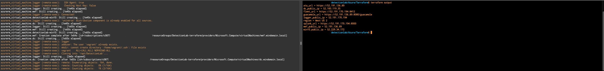
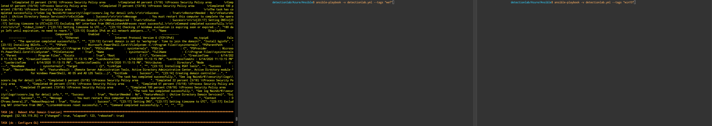

# Building DetectionLab on Azure

## Prereqs (~30-60 minutes)
0. Have an active [Azure account](https://azure.microsoft.com/en-us/free/). If you don't have one yet, they give you $200 worth of credit to use within the first 30 days!
1. [Install Terraform](https://www.terraform.io/downloads.html) and move it to a directory included in your system's PATH.
2. [Install Ansible](https://docs.ansible.com/ansible/latest/installation_guide/intro_installation.html). This will be used to provision the instances. Some users may prefer to install Ansible inside of a virtual environment; that's fine too.
3. [Install the Azure command line client](https://docs.microsoft.com/en-us/cli/azure/install-azure-cli?view=azure-cli-latest) and make sure it's included in your system's PATH.
4. Either create or re-use an existing SSH keypair that you'll use to authenticate to the logger host
5. Make sure you've pulled down the most recent changes from the DetectionLab git repo
6. Please note that the default credentials before provisioning are `vagrant:Vagrant123` due to the windows SKU/AMI password complexity requirements!

## Steps
### Terraform
1. **(5 Minutes)** - Configure the `terraform.tfvars` file
   1. Copy the file at `/DetectionLab/Azure/Terraform/terraform.tfvars.example` to `/DetectionLab/Azure/Terraform/terraform.tfvars`
   2. In the newly copied terraform.tfvars, provide a value for each variable.

2. **(5 Minutes)** - Authenticate to Azure using `az`
   1. Run `az login`. This should bring up a browser that asks you to sign into your Azure account.
   2. Sign in and the window should say "You have logged into Microsoft Azure!"

3. **(3-20 Minutes)** - Bring up the VM's using Terraform
   1. `cd` to `Azure/Terraform` and run `terraform init` to initialize the working directory
   2. Make sure you followed the pre-reqs and have a `terraform.tfvars` file present with your public IP address whitelisted
   3. Run `terraform apply` to check the Terraform plan or `terraform apply --auto-approve` to bypass the check
   4. It will take ~20 minutes for logger to come online and finish provisioning, but **you can move onto the next step once you see that DC, WEF, and WIN10 have fininshed creation** (usually around 2 minutes):
   ```
   azurerm_virtual_machine.dc: Creation complete after 1m55s
   azurerm_virtual_machine.wef: Creation complete after 1m54s
   azurerm_virtual_machine.win10: Creation complete after 1m55s
   ```

At this point in time, we're at this state:
* Logger VM has been brought up and is provisioning
* DC VM has been brought up but is unprovisioned
* DC VM has been brought up but is unprovisioned
* DC VM has been brought up but is unprovisioned

At this point in time, you should be able to open a new terminal window, navigate to `DetectionLab/Azure/Terraform` and run `terraform output`. You should see something like the following:
```
ata_url = https://52.191.136.x
dc_public_ip = 52.183.119.x
fleet_url = https://52.191.170.x:8412
guacamole_url = https://52.191.136.x:8080/guacamole
logger_public_ip = 52.191.170.x
region = West US 2
splunk_url = https://52.191.170.x:8000
wef_public_ip = 52.191.136.x
win10_public_ip = 52.229.34.x
```



We're going to use this output in the next step.

---
### Ansible
We're going to use Ansible to fininsh provisioning the rest of the Windows hosts.

1. **(5 Minutes)** - Configure the `inventory.yml` file
   1. Navigate to `Azure/Ansible` and open `inventory.yml` for editing. 
   2. Take the `public_ip` values from `terraform output` and replace the `x.x.x.x` values with the public IP of each host
   NOTE: I've added a script at `DetectionLab/Azure/build_ansible_inventory.sh` to help automate this.

Now that Ansible is configured for provisioning, there are two ways to go about this:

* Provision each host one at a time (e.g. DC, then WEF, then WIN10). This is slower, but requires less steps.
* Provision the DC, then provision WEF and WIN10 simultaneously. This is faster, but you'll have to open multiple terminals and do a bit of manual work.

For the provisioning to be successful, the DC has to spin up Active Directory before provisioning of the WEF and WIN10 hosts can begin, otherwise they will fail to join the domain and provisioning will fail.

If you'd like to take the slower but easier route, ensure you're in `DetectionLab/Azure/Ansible` and run `ansible-playbook -v detectionlab.yml`. This will provision the hosts one at a time (DC, WEF, then WIN10). However, if you'd like to go the faster route, follow the directions below.

If you'd like to take the faster route, I recommend opening 3 terminal windows to `DetectionLab/Azure/Ansible` and following the following steps:
1. In the first window, run `ansible-playbook -v detectionlab.yml --tags "dc"`
2. Once the DC has passed the `Reboot Afer Domain Creation` Ansible step, you can begin provisioning WEF and WIN10
3. In the second window, run `ansible-playbook -v detectionlab.yml --tags "wef"`
4. In the third window, run `ansible-playbook -v detectionlab.yml --tags "win10"`



If you run into any issues along the way, please open an issue on Github and I'll do my best to find a solution.

## Debugging / Troubleshooting / Known Issues
* If an Ansible playbook fails (and they sometimes do), you can pick up where it left off with `ansible-playbook -vvv detectionlab.yml --tags="hostname-goes-here" --start-at-task="taskname"`
* "Installing Red Team Tooling" hangs if AV isn't disabled successfully
* It seems like sometimes the logger provisioning "errors" somewhere and causes the box to become tained, despite the provision being successful. Work around this by untainting it: `terraform untaint azurerm_virtual_machine.dc`
* If running Ansible causes a `fork()` related error message, set the following environment variable before running Ansible: `export OBJC_DISABLE_INITIALIZE_FORK_SAFETY=YES`. More on this [here](https://github.com/clong/DetectionLab/issues/543).

## Future work required
* It probably makes sense to abstract all of the logic in `logger_bootstrap.sh` into individual Ansible tasks
* I imagine there's a streamlined way to get the results of `terraform output` into the `inventory.yml` for Ansible.
* I'm guessing there's a way to parallelize some of this execution or make some of it asynchronous: https://medium.com/developer-space/parallel-playbook-execution-in-ansible-30799ccda4e0 and https://docs.ansible.com/ansible/latest/user_guide/playbooks_async.html

## Credits
As usual, this work is based off the heavy lifting that others have done. My primary sources for this work were:
* [The DetectionLab work that juju4 has been doing on Azure and Ansible.](https://github.com/juju4/DetectionLab/tree/devel-azureansible/Ansible) At least 90% of this code was borrowed from their work.
* [Automate Windows VM Creation and Configuration in vSphere Using Packer, Terraform and Ansible - Dmitry Teslya](https://dteslya.engineer/automation/2019-02-19-configuring_vms_with_ansible/#setting-up-ansible)

Thank you to all of the sponsors who made this possible!
