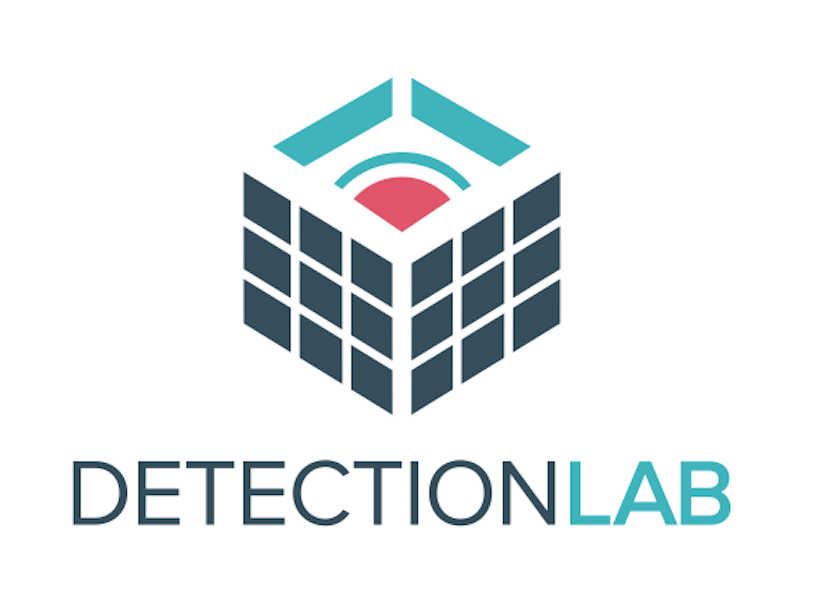

# Detection Lab
DetectionLab is tested weekly on Saturdays via a scheduled CircleCI workflow to ensure that builds are passing.

[](https://circleci.com/gh/clong/DetectionLab/tree/master)
[](https://github.com/clong/DetectionLab/blob/master/license.md)

[](https://github.com/clong/DetectionLab/commit/master)
[](https://twitter.com/DetectionLab)

#### Donate to the project:

All of the infrastructure, building, and testing of DetectionLab is currently funded by myself in my spare time. If you find this project useful, feel free to buy me a coffee using one of the buttons below!

[](https://github.com/sponsors/clong)
[](https://www.paypal.com/paypalme2/clong0)
[](https://commerce.coinbase.com/checkout/838ac7a2-7b9d-4d40-b475-fd1015fdaacd)

## Purpose
This lab has been designed with defenders in mind. Its primary purpose is to allow the user to quickly build a Windows domain that comes pre-loaded with security tooling and some best practices when it comes to system logging configurations. It can easily be modified to fit most needs or expanded to include additional hosts.

Read more about Detection Lab on Medium here: https://medium.com/@clong/introducing-detection-lab-61db34bed6ae

NOTE: This lab has not been hardened in any way and runs with default vagrant credentials. Please do not connect or bridge it to any networks you care about. This lab is deliberately designed to be insecure; the primary purpose of it is to provide visibility and introspection into each host.

## Primary Lab Features:
* Microsoft Advanced Threat Analytics (https://www.microsoft.com/en-us/cloud-platform/advanced-threat-analytics) is installed on the WEF machine, with the lightweight ATA gateway installed on the DC
* Splunk forwarders are pre-installed and all indexes are pre-created. Technology add-ons for Windows are also preconfigured.
* A custom Windows auditing configuration is set via GPO to include command line process auditing and additional OS-level logging
* [Palantir's Windows Event Forwarding](http://github.com/palantir/windows-event-forwarding)  subscriptions and custom channels are implemented
* Powershell transcript logging is enabled. All logs are saved to `\\wef\pslogs`
* osquery comes installed on each host and is pre-configured to connect to a [Fleet](https://kolide.co/fleet) server via TLS. Fleet is preconfigured with the configuration from [Palantir's osquery Configuration](https://github.com/palantir/osquery-configuration)
* Sysmon is installed and configured using SwiftOnSecurity’s open-sourced configuration
* All autostart items are logged to Windows Event Logs via [AutorunsToWinEventLog](https://github.com/palantir/windows-event-forwarding/tree/master/AutorunsToWinEventLog)
* SMBv1 Auditing is enabled


## Requirements
* 55GB+ of free disk space
* 16GB+ of RAM
* Packer 1.3.2 or newer
* Vagrant 2.2.2 or newer
* Virtualbox or VMWare Fusion/Workstation

---

## Quickstart
* [AWS](https://github.com/clong/DetectionLab/wiki/Quickstart---AWS-(Terraform))
* [MacOS](https://github.com/clong/DetectionLab/wiki/Quickstart---MacOS)
* [Windows](https://github.com/clong/DetectionLab/wiki/Quickstart---Windows)
* [Linux](https://github.com/clong/DetectionLab/wiki/Quickstart-Linux)

---

## Building DetectionLab from Scratch
1. Determine which Vagrant provider you want to use. Current supported providers are:

  - Virtualbox
  - VMware Workstation & Fusion
    - Note: Virtualbox is free, the [VMWare Desktop Vagrant plugin](https://www.vagrantup.com/vmware/#buy-now) is $80 and is required to use Vagrant with VMware.

There are currently three ways to build the lab:
* **Recommended**: Use the boxes hosted on [Vagrant Cloud](https://app.vagrantup.com/detectionlab). This method should take **~2 hours** total to download the boxes and provision the lab.
* Build the boxes yourself using Packer. This method will take ~4 hours to build the boxes and another ~90-120 minutes to provision them for a total of **5-6 hours**.
* [Provision the lab in AWS using Terraform](Terraform/README.md). The lab can be brought online in under **30 minutes**.

If you choose to use the boxes hosted on Vagrant Cloud, you may skip steps 2 and 3. If you don't trust pre-built boxes, I recommend following steps 2 and 3 to build them on your machine.


2. `cd` to the Packer directory and build the Windows 10 and Windows Server 2016 boxes using the commands below. Each build will take about 1 hour. As far as I know, you can only build one box at a time.

```
$ cd detectionlab/Packer
$ packer build --only=[vmware|virtualbox]-iso windows_10.json
$ packer build --only=[vmware|virtualbox]-iso windows_2016.json
```

3. Once both boxes have built successfully, move the resulting boxes (.box files) in the Packer folder to the Boxes folder:

    `mv *.box ../Boxes`

4. `cd` into the Vagrant directory: `cd ../Vagrant` and edit the `Vagrantfile`. Change the lines `cfg.vm.box = "detectionlab/win2016"` and `cfg.vm.box = "detectionlab/win10` to `cfg.vm.box = "../Boxes/windows_2016_<provider>.box"` and "`cfg.vm.box = "../Boxes/windows_10_<provider>.box"` respectively.

5. Install the Vagrant-Reload plugin: `vagrant plugin install vagrant-reload`

6. **VMware Only:**  
  * [Buy a license](https://www.vagrantup.com/vmware/index.html#buy-now) for the VMware plugin
  * Install it with `vagrant plugin install vagrant-vmware-desktop`.
  * License it with `vagrant plugin license vagrant-vmware-desktop <path_to_.lic>`.
  * Download and install the VMware Vagrant utility: https://www.vagrantup.com/vmware/downloads.html

7. Ensure you are in the base DetectionLab folder and run `./build.sh` (Mac & Linux) or `./build.ps1` (Windows). This script will do the following:
  * Provision the logger host. This host will run the [Fleet](https://kolide.co/fleet) osquery manager and a fully featured pre-configured Splunk instance.
  * Provision the DC host and configure it as a Domain Controller
  * Provision the WEF host and configure it as a Windows Event Collector in the Servers OU
  * Provision the Win10 host and configure it as a computer in the Workstations OU

8. Build logs will be present in the `Vagrant` folder as `vagrant_up_<host>.log`. If filing an issue, please paste the contents of that log into a Gist to help with debugging efforts.

9. Navigate to https://192.168.38.105:8000 in a browser to access the Splunk instance on logger. Default credentials are admin:changeme (you will have the option to change them on the next screen)
10. Navigate to https://192.168.38.105:8412 in a browser to access the Fleet server on logger. Default credentials are admin:admin123#. Query packs are pre-configured with queries from [palantir/osquery-configuration](https://github.com/palantir/osquery-configuration).

---

## Basic Vagrant Usage

Moved to the wiki: [Basic Vagrant Usage](https://github.com/clong/DetectionLab/wiki/Vagrant-Usage)

---

## Lab Information

Moved to the wiki: [Lab Information & Credentials](https://github.com/clong/DetectionLab/wiki/Lab-Information-&-Credentials)

---

## Known Issues and Workarounds

Moved to the wiki: [Known Issues and Workarounds](https://github.com/clong/DetectionLab/wiki/Known-Issues-and-Workarounds)

---

## Contributing
Please do all of your development in a feature branch on your own fork of DetectionLab.
Contribution guidelines can be found here: [CONTRIBUTING.md](./CONTRIBUTING.md)

## In the Media
* [DetectionLab, Chris Long – Paul’s Security Weekly #593](https://securityweekly.com/2019/02/08/detectionlab-chris-long-pauls-security-weekly-593/)
* [TaoSecurity - Trying DetectionLab](https://taosecurity.blogspot.com/2019/01/trying-detectionlab.html)
* [Setting up Chris Long's DetectionLab](https://www.psattack.com/articles/20171218/setting-up-chris-longs-detectionlab/)
* [Detection Lab: Visibility & Introspection for Defenders](https://isc.sans.edu/forums/diary/Detection+Lab+Visibility+Introspection+for+Defenders/23135/)

## Credits/Resources
A sizable percentage of this code was borrowed and adapted from [Stefan Scherer](https://twitter.com/stefscherer)'s [packer-windows](https://github.com/StefanScherer/packer-windows) and [adfs2](https://github.com/StefanScherer/adfs2) Github repos. A huge thanks to him for building the foundation that allowed me to design this lab environment.

# Acknowledgements
* [Microsoft Advanced Threat Analytics](https://www.microsoft.com/en-us/cloud-platform/advanced-threat-analytics)
* [Splunk](https://www.splunk.com)
* [osquery](https://osquery.io)
* [Fleet](https://kolide.co/fleet)
* [Windows Event Forwarding for Network Defense](https://medium.com/@palantir/windows-event-forwarding-for-network-defense-cb208d5ff86f)
* [palantir/windows-event-forwarding](http://github.com/palantir/windows-event-forwarding)
* [osquery Across the Enterprise](https://medium.com/@palantir/osquery-across-the-enterprise-3c3c9d13ec55)
* [palantir/osquery-configuration](https://github.com/palantir/osquery-configuration)
* [Configure Event Log Forwarding in Windows Server 2012 R2](https://www.petri.com/configure-event-log-forwarding-windows-server-2012-r2)
* [Monitoring what matters — Windows Event Forwarding for everyone](https://blogs.technet.microsoft.com/jepayne/2015/11/23/monitoring-what-matters-windows-event-forwarding-for-everyone-even-if-you-already-have-a-siem/)
* [Use Windows Event Forwarding to help with intrusion detection](https://technet.microsoft.com/en-us/itpro/windows/keep-secure/use-windows-event-forwarding-to-assist-in-instrusion-detection)
* [The Windows Event Forwarding Survival Guide](https://hackernoon.com/the-windows-event-forwarding-survival-guide-2010db7a68c4)
* [PowerShell ♥ the Blue Team](https://blogs.msdn.microsoft.com/powershell/2015/06/09/powershell-the-blue-team/)
* [Autoruns](https://www.microsoftpressstore.com/articles/article.aspx?p=2762082)
* [TA-microsoft-sysmon](https://github.com/splunk/TA-microsoft-sysmon)
* [SwiftOnSecurity - Sysmon Config](https://github.com/SwiftOnSecurity/sysmon-config)
* [ThreatHunting](https://github.com/olafhartong/ThreatHunting)
* [sysmon-modular](https://github.com/olafhartong/sysmon-modular)
* [Atomic Red Team](https://github.com/redcanaryco/atomic-red-team)
