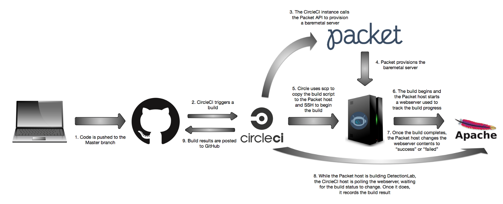

# Continuous Integration

The files in this directory are used to bootstrap an Ubuntu 16.04 baremetal server
for continuous integration testing by installing the prerequisites needed for
Detection Lab. After the prerequisites are installed, the build script is called
and the build will begin in a tmux session.

